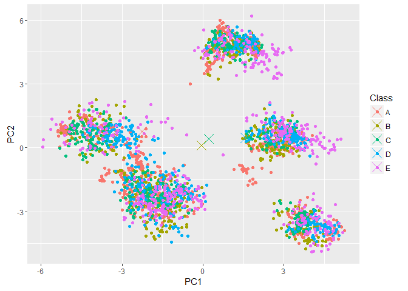

# Practical Machine Learning Prediction Assignment Writeup
Mun Yee Lee  
July 22, 2016  

#Backgroud
Using devices such as Jawbone Up, Nike FuelBand, and Fitbit it is now possible to collect a large amount of data about personal activity relatively inexpensively. These type of devices are part of the quantified self movement - a group of enthusiasts who take measurements about themselves regularly to improve their health, to find patterns in their behavior, or because they are tech geeks. One thing that people regularly do is quantify how much of a particular activity they do, but they rarely quantify how well they do it. In this project, your goal will be to use data from accelerometers on the belt, forearm, arm, and dumbell of 6 participants. They were asked to perform barbell lifts correctly and incorrectly in 5 different ways. More information is available from the website here: http://groupware.les.inf.puc-rio.br/har (see the section on the Weight Lifting Exercise Dataset). 

#Getting and Cleaning Data
Download data the training and testing data from link below:
https://d396qusza40orc.cloudfront.net/predmachlearn/pml-training.csv

https://d396qusza40orc.cloudfront.net/predmachlearn/pml-testing.csv

Clean the data set as some of the data in data set are missing.
Function "FindBlank" is used and clean the data sets to get "TrainData" and "TestData" as follows(just show part of the data):


```
## Warning: package 'caret' was built under R version 3.2.5
```

```
## Loading required package: lattice
```

```
## Loading required package: ggplot2
```

```
## Warning: package 'ggplot2' was built under R version 3.2.5
```

```r
summary(TrainData)[,7:12]
```

```
##    num_window        roll_belt          pitch_belt        
##  "Min.   :  1.0  " "Min.   :-28.90  " "Min.   :-55.8000  "
##  "1st Qu.:222.0  " "1st Qu.:  1.10  " "1st Qu.:  1.7600  "
##  "Median :424.0  " "Median :113.00  " "Median :  5.2800  "
##  "Mean   :430.6  " "Mean   : 64.41  " "Mean   :  0.3053  "
##  "3rd Qu.:644.0  " "3rd Qu.:123.00  " "3rd Qu.: 14.9000  "
##  "Max.   :864.0  " "Max.   :162.00  " "Max.   : 60.3000  "
##  NA                NA                 NA                  
##     yaw_belt         total_accel_belt   gyros_belt_x        
##  "Min.   :-180.00  " "Min.   : 0.00  " "Min.   :-1.040000  "
##  "1st Qu.: -88.30  " "1st Qu.: 3.00  " "1st Qu.:-0.030000  "
##  "Median : -13.00  " "Median :17.00  " "Median : 0.030000  "
##  "Mean   : -11.21  " "Mean   :11.31  " "Mean   :-0.005592  "
##  "3rd Qu.:  12.90  " "3rd Qu.:18.00  " "3rd Qu.: 0.110000  "
##  "Max.   : 179.00  " "Max.   :29.00  " "Max.   : 2.220000  "
##  NA                  NA                NA
```

```r
head(TrainData,4)[,7:12]
```

```
##   num_window roll_belt pitch_belt yaw_belt total_accel_belt gyros_belt_x
## 1         11      1.41       8.07    -94.4                3         0.00
## 2         11      1.41       8.07    -94.4                3         0.02
## 3         11      1.42       8.07    -94.4                3         0.00
## 4         12      1.48       8.05    -94.4                3         0.02
```

```r
head(TestData,4)[,7:12]
```

```
##   num_window roll_belt pitch_belt yaw_belt total_accel_belt gyros_belt_x
## 1         74    123.00      27.00    -4.75               20        -0.50
## 2        431      1.02       4.87   -88.90                4        -0.06
## 3        439      0.87       1.82   -88.50                5         0.05
## 4        194    125.00     -41.60   162.00               17         0.11
```


#PCA & Slicing Data
About 60 features without blank or missing value are chosen from the original data, but 60 is also a large feature set. In order to get less and typical features which show relatively obvious difference between each two types. Preprocessing the data by PCA(the data have already been scaled and centerred before PCA). This step will get a data sets of 37 "features" named from PC1 to PC37(The reason of choose first 37 features will be stated at the Cross Validation Part).

Training data(PCAtrainData) will be use to built a model. Slicing the training data into a subset of one smaller training data set(training) and a subset of testing data(testing) which was 1/4 size of the training data. But in fact, training data(PCAtrainData) was much larger to train a classification model. Randomly picked 20 percent of the whole PCAtrainData to make a new smaller training data set(PPCAtrainData), and then sliced 3/4 of PPCAtrainData to train the model and 1/4 of the PPCAtrainData to test whether current model is good enough.


```r
Pick <- createDataPartition(y = PCAtrainData$Class, p = 0.2, list = FALSE)
PPCAtrainData <- PCAtrainData[Pick,]
inTrain <- createDataPartition(y = PPCAtrainData$Class, p = 0.75, list = FALSE)
training <- PPCAtrainData[inTrain,]
testing <- PPCAtrainData[-inTrain,]
```

#Cross Validation & Error Analysis

To analysis the sample error, show the internal and external sample error of objects and further discuss about the feature error.
First of all, using the same object twice to built the model1 and model2, and compute the in sample error of the same objects. The error rate is:


```
## Loading required package: randomForest
```

```
## Warning: package 'randomForest' was built under R version 3.2.5
```

```
## randomForest 4.6-12
```

```
## Type rfNews() to see new features/changes/bug fixes.
```

```
## 
## Attaching package: 'randomForest'
```

```
## The following object is masked from 'package:ggplot2':
## 
##     margin
```

```
## [1] -0.06896552
```

Then, use different objects(but the number of objects is same) to built the model3 and compute the out of sample error. The error rate is:


```
## [1] -0.02413793
```

We can see that both internal and external sample error is small. Remember we uses the PCA and preprocess the features. So, the differences between objects with the same features is not so obvious. But the differences between features is something need to consider.

Repeat the step above and keeping the objects unchange, but using the same and different features to calculate the internal and external sample error of features. The error rate is:


```
## [1] 0
```

```
## Warning in is.na(e1) | is.na(e2): longer object length is not a multiple of
## shorter object length
```

```
## Warning in `==.default`(pred3, testing[c(1:5, 300:305, 500:505, 690:695, :
## longer object length is not a multiple of shorter object length
```

```
## [1] -0.04597701
```

The results show that internal sample error can be ignored but the external sample error is obvious, which means that the the features with larger distinction between different classes of objects should be included into model. Choose first 37 features, for they can intercept 99% of the difference between objects of different classes.

#Training Model

Now, let's train the model, you can see some information of modelFit:
The "leave one out" method is used to get some fitted parameter:

```r
trControl <- trainControl(method = "LOOCV",p = 0.75, horizon = 1)
```


```r
set.seed(1235)
modelFit <- train(Class ~ ., data = training, method = "rf", prox = TRUE)
modelFit
```

```
## Random Forest 
## 
## 2946 samples
##   37 predictor
##    5 classes: 'A', 'B', 'C', 'D', 'E' 
## 
## No pre-processing
## Resampling: Bootstrapped (25 reps) 
## Summary of sample sizes: 2946, 2946, 2946, 2946, 2946, 2946, ... 
## Resampling results across tuning parameters:
## 
##   mtry  Accuracy   Kappa    
##    2    0.8900398  0.8604101
##   19    0.8730076  0.8388988
##   37    0.8638429  0.8273113
## 
## Accuracy was used to select the optimal model using  the largest value.
## The final value used for the model was mtry = 2.
```
Gettign a single tree:

```
##    left daughter right daughter split var  split point status prediction
## 1              2              3         3  0.307704001      1          0
## 2              4              5        25 -0.916899733      1          0
## 3              6              7         6  0.083295664      1          0
## 4              8              9        27 -0.591244263      1          0
## 5             10             11         3 -2.635701941      1          0
## 6             12             13        36  0.551268217      1          0
## 7             14             15        10 -0.102315374      1          0
## 8             16             17        34 -0.243777303      1          0
## 9             18             19        25 -1.486097343      1          0
## 10            20             21        23 -0.654702615      1          0
## 11            22             23        10 -1.962527396      1          0
## 12            24             25        37 -0.170138883      1          0
## 13             0              0         0  0.000000000     -1          5
## 14            26             27         2 -4.009778431      1          0
## 15            28             29         4  0.844619253      1          0
## 16             0              0         0  0.000000000     -1          2
## 17            30             31        37  0.007662894      1          0
## 18             0              0         0  0.000000000     -1          5
## 19            32             33        37 -1.102032090      1          0
## 20            34             35         8 -3.338320733      1          0
```
For a obverious look, draw the class centering figure(use two most distict features PC1 and PC2):
<!-- -->
The Accuracy of my model:

```
##     
## pred   A   B   C   D   E
##    A 270  10   5   2   2
##    B   4 171   6   2   2
##    C   0   8 152  17   5
##    D   3   0   7 138   4
##    E   2   1   1   2 167
```

```
##    Accuracy
## 1 0.9153925
```
Finally, test the given 20 problems by fitted model obtained just now and get a predictions:

```r
answers <- predict(modelFit,PCAtestData);
answers
```

```
##  [1] B A B A A E D B A A B C B A E E A B B B
## Levels: A B C D E
```


